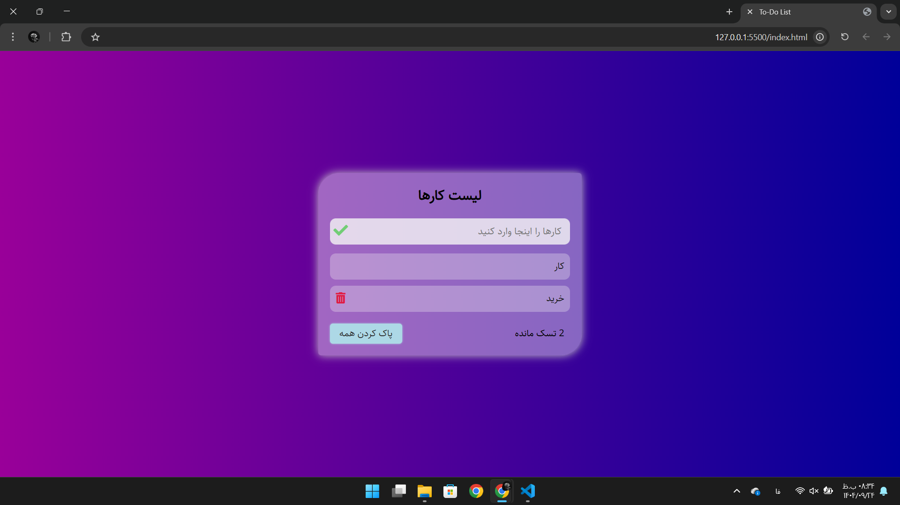

# 📝 To-Do List Web Project

## 📌 About the Project
A simple and elegant web app for managing daily tasks (**To-Do List**) built with **HTML, CSS, and Vanilla JavaScript**.  
Users can easily add, delete, and track tasks with a responsive design and modern UI.

---

## 📸 Screenshot


| Screenshot |
|-----------|
|  |


---

## ✨ Features
- Add new tasks by typing text and clicking the button or pressing **Enter**
- Display the count of remaining tasks
- Delete individual tasks with a trash icon
- Clear all tasks with a single button
- Persistent storage using **localStorage** (tasks remain after closing the browser)
- Fully **responsive** design for mobile and desktop
- RTL support for Persian language
- Modern UI with hover effects and transparency

---

## ⚡ Tech Stack
- **HTML5** – Page structure  
- **CSS3** – Flexbox, gradients, media queries  
- **JavaScript (Vanilla JS)** – Logic and functionality  
- **Font Awesome** – Icons  
- **Sahel Font** – Persian typography  

---

## 🧠 JavaScript Highlights

- localStorage: save, get, update, delete tasks

- Create & insert elements dynamically (createElement, append, prepend, before, after)

- Event Delegation for delete actions

- Array management & splice()

- UI re-rendering & dataset usage

- Clean separation of render, save, get functions

---

## 📂 File Structure
```bash
textproject-folder/
├── index.html        → Main page structure
├── style.css         → Styling and responsive design
├── main.js           → App logic (add, delete, save tasks)
├── font/
│   ├── Sahel.woff
│   └── Sahel.woff2
└── Screenshots/
    └── Screenshot.png
```

---

## 🚀 How to Run
Place all files in a single folder.

Open index.html in your browser (double-click).

No server or extra setup needed — fully offline.

---

## 👨‍💻 Author
Amir Nouaparast  
GitHub: [Amir Nouaparast](https://github.com/AmirNouaparast)  
Frontend Developer | React & Vanilla JS Enthusiast | Clean Code Lover ☕  


